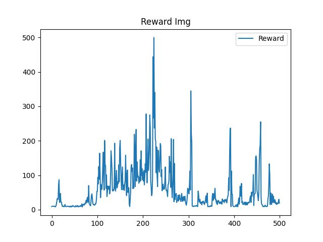

# Text Classify in LSTM

[中文](README_cn.md) | 英文

Using DQN algorithm, deep reinforcement learning is realized




# Requirement

```
torch
torchtext
matplotlib
tqdm
```

# How to run

```
cd ~/image_classify
python run.py
```

The sample code then automatically builds an interactive environment based on the global Settings and starts training, with default logs saved in the <code>log/</code> directory

You can also modify the global Settings by following the instructions below

# Global Config

**CUDA Acceleration**

You can set the size of the experience recovery pool and the number of batches per sample

```config.json
{
    "buffer":{
        "buffer_size": 10000,
        "minimal_size": 500,
        "batch_size": 64
    },
}
```

**Log Settings**

You can set the log root directory and the number of models automatically saved per training session

```config.json
{
    "log": {
    "root": "log/",
    "save_num": 4
    }
}
```

**Agent Algorithm Settings**

You can set the learning rate, decay factor, exploration rate, and update batch for reinforcement learning agent training

```config.json
{
    "agent":{
        "lr": 1e-3,
        "gamma": 0.98,
        "epsilon": 0.10,
        "target_update": 10
    },
}
```

**Training Settings**

You can set the training batch and model learning rate

```config.json
{
    "train": {
        "epochs": 500,
    }
}
```

**Visual Settings**

You can set the path to save the final training data visualization

You can set the training batch and model learning rate

```config.json
{
    "show": {
        "reward_img": "reward_img.jpg"
    }
}
```