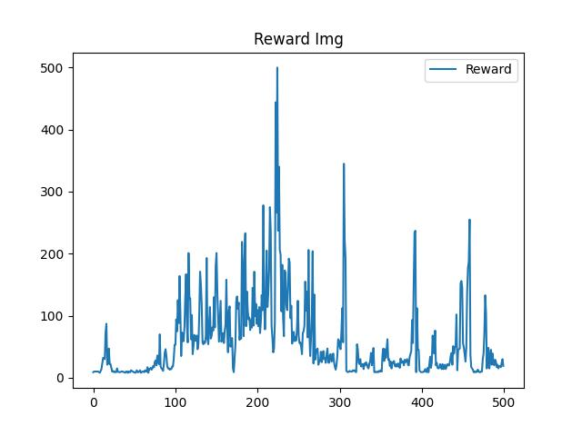

# 深度强化学习-DQN

中文 | [英文](README.md)

使用 DQN 算法，实现深度强化学习




# 环境依赖

```
torch
numpy
matplotlib
gym
tqdm
```

# 如何运行

```
cd ~/DRL_in_DQN
python train.py
```

然后示例代码会根据全局设置自动构建交互环境并开始训练，默认日志保存在 <code>log/</code> 目录

你也可以根据下方指引自行修改全局设置

# 全局设置

你可以在 config.json 中进行一些全局设置，包括以下内容

**CUDA 加速**

你可以打开或关闭模型训练或推理的 CUDA 加速

```config.json
{
    "cuda": true
}
```

**日志设置**

你可以设置日志的根目录和每次训练时自动保存的模型数目

```config.json
{
    "log": {
        "root": "log/",
        "save_num": 4
    }
}
```

**经验回收池设置**

你可以设置经验回收池的大小和每次采样的批数

```config.json
{
    "buffer":{
        "buffer_size": 10000,
        "minimal_size": 500,
        "batch_size": 64
    },
}
```

**智能体算法设置**

你可以设置强化学习智能体训练时的学习率、衰减因子、探索率和更新批次

```config.json
{
    "agent":{
        "lr": 1e-3,
        "gamma": 0.98,
        "epsilon": 0.10,
        "target_update": 10
    },
}
```

**训练设置**

你可以设置训练的批次和模型学习率

```config.json
{
    "train": {
        "epochs": 500,
    }
}
```

**可视化设置**

你可以设置最后训练数据可视化的保存路径

你可以设置训练的批次和模型学习率

```config.json
{
    "show": {
        "reward_img": "reward_img.jpg"
    }
}
```