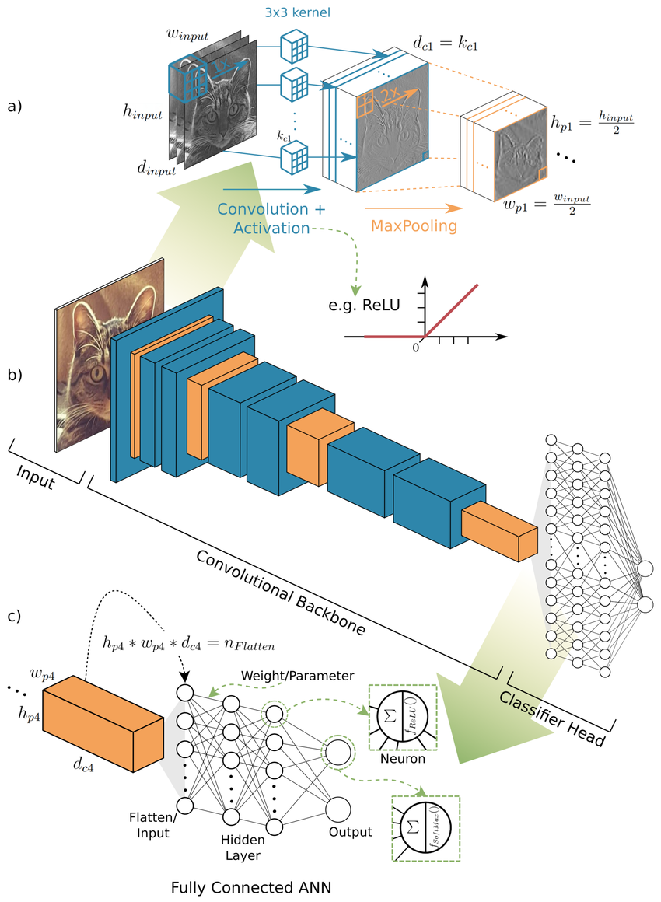
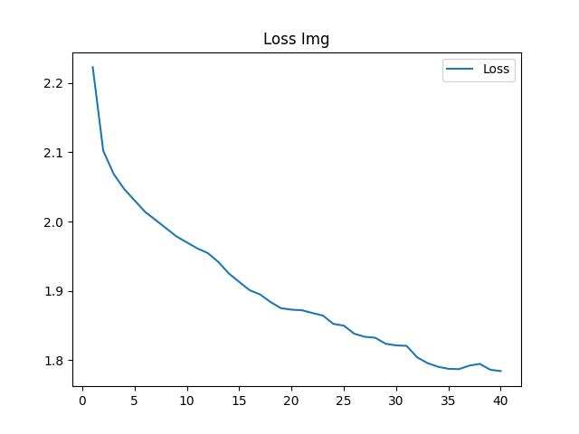
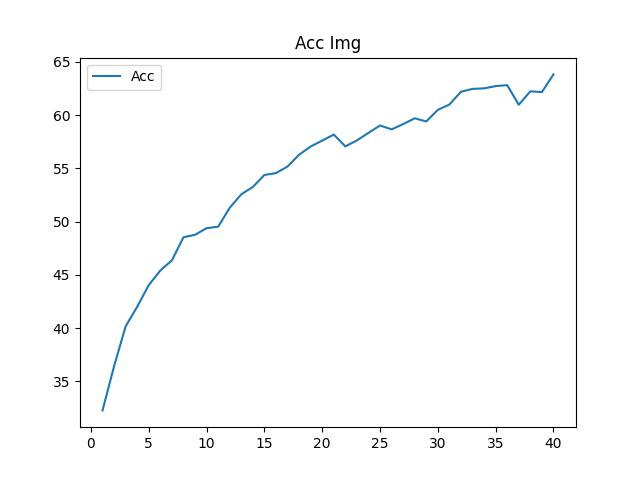

# Image Classify in CNN

[Chinese](README_cn.md) | English

A simple convolutional neural network is used to classify images



<center class = "half">

</center>

# Requirement

```
torch
torchvision
matplotlib
tqdm
```

# How to run

```
cd ~/image_classify_in_CNN
python train.py
```

The sample code then automatically downloads the data set according to the global Settings and starts training. By default, the data set is downloaded in the <code>data/</code> directory, and the logs are saved in the <code>log/</code> directory

You can also modify the global Settings by following the instructions below

# Global Config

**CUDA Acceleration**

You can turn on or off CUDA acceleration for model training or inference

```config.json
{
    "cuda": true
}
```

**Log Settings**

You can set the log root directory and the number of models automatically saved per training session

```config.json
{
    "log": {
    "root": "log/",
    "save_num": 4
    }
}
```

**Data set Catalog**

You can set the save root of the dataset and download or not options

```config.json
{
    "data": {
    "download": true,
    "root": "data/"
    }
}
```

**Data loading Settings**

You can set the amount of data the data loader loads at a time

```config.json
    {
    "dataloader": {
    "train_batch_size": 1024,
    "test_batch_size": 1024
    }
}
```

**Training Settings**

You can set the training batch and model learning rate

```config.json
{
    "train": {
    "epochs": 10,
    "learning_rate": 1e-3
    }
}
```

**Visual Settings**

You can set the path to save the final training data visualization

You can set the training batch and model learning rate

```config.json
{
    "show": {
    "acc_img": "acc_img.jpg",
    "loss_img": "loss_img.jpg"
    }
}
```