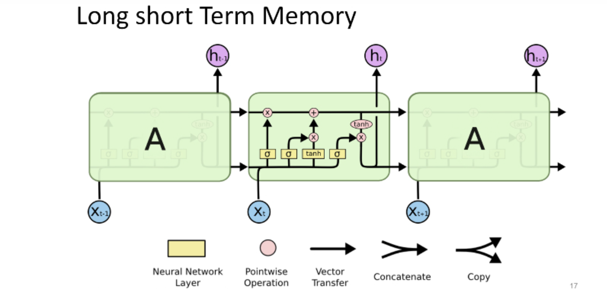

# 文本分类-LSTM

中文 | [英文](README.md)

使用简易的 LSTM 模型，对文本做分类



# 环境依赖

```
torch
torchtext
matplotlib
tqdm
```

# 如何运行

```
cd ~/text_classify_in_LSTM
python run.py
```

然后示例代码会根据全局设置自动下载数据集并开始训练，默认下数据集下载于 <code>data/</code> 目录，日志保存在 <code>log/</code> 目录

你也可以根据下方指引自行修改全局设置

# 全局设置

你可以在 config.json 中进行一些全局设置，包括以下内容

**CUDA 加速**

你可以打开或关闭模型训练或推理的 CUDA 加速

```config.json
{
    "cuda": true
}
```

**日志设置**

你可以设置日志的根目录和每次训练时自动保存的模型数目

```config.json
{
    "log": {
        "root": "log/",
        "save_num": 4
    }
}
```

**数据集目录**

你可以设置数据集的保存根目录和是否下载选项

```config.json
{
    "data": {
        "download": true,
        "root": "data/"
    }
}
```

**数据加载设置**

你可以设置数据加载器每次加载的数据量

```config.json
{
    "dataloader": {
        "train_batch_size": 1024,
        "test_batch_size": 1024
    }
}
```

**训练设置**

你可以设置训练的批次和模型学习率

```config.json
{
    "train": {
        "epochs": 10,
        "learning_rate": 1e-3
    }
}
```

**可视化设置**

你可以设置最后训练数据可视化的保存路径

你可以设置训练的批次和模型学习率

```config.json
{
    "show": {
        "acc_img": "acc_img.jpg",
        "loss_img": "loss_img.jpg"
    }
}
```